# MathExpr - Mathematical Expression Calculator in Rust

A Rust library and command-line tool that parses and evaluates mathematical expressions. It handles basic arithmetic operations, scientific notation, and complex expressions with proper operator precedence.

## Architecture

```mermaid 
    graph TD
    subgraph DataFlow
        A[Input String] --> B[Tokenizer]
        B --> C[Token Stream]
        C --> D[Parser]
        D --> E[AST]
        E --> F[Expression Tree]
        F --> G[Evaluator]
        G --> H[Result]
    end

    subgraph Components
        Token[Token]
        Op[Op]
        Expr[Expr]
        TokenStream[TokenStream]
        Parser[Parser]
        Evaluator[Evaluator]
        Error[Error]
    end

    subgraph TokenDef[Token Types]
        Token --- Number[Number]
        Token --- Operator[Operator]
        Token --- LParen[LParen]
        Token --- RParen[RParen]
        Token --- Scientific[Scientific]
    end

    subgraph OpDef[Operators]
        Op --- Add[Add]
        Op --- Sub[Subtract]
        Op --- Mul[Multiply]
        Op --- Div[Divide]
        Op --- Pow[Power]
    end

    subgraph ExprDef[Expression Types]
        Expr --- Literal[Literal]
        Expr --- BinOp[BinOp]
        Expr --- UnaryMinus[UnaryMinus]
        Expr --- SciExpr[Scientific]
    end

    subgraph ErrorDef[Error Types]
        Error --- ET[UnexpectedToken]
        Error --- UP[UnmatchedParenthesis]
        Error --- IN[InvalidNumber]
        Error --- DB[DivisionByZero]
        Error --- IE[InvalidExpression]
    end

    TokenStream --> Token
    Parser --> TokenStream
    Parser --> Expr
    Parser --> Error
    Evaluator --> Expr
    Evaluator --> Error
    Token --> Op

    style DataFlow fill:#bbf,stroke:#333,stroke-width:2px
    style Components fill:#bfb,stroke:#333,stroke-width:2px
    style TokenDef fill:#fbf,stroke:#333,stroke-width:2px
    style OpDef fill:#fbb,stroke:#333,stroke-width:2px
    style ExprDef fill:#bff,stroke:#333,stroke-width:2px
    style ErrorDef fill:#ffb,stroke:#333,stroke-width:2px
```



## Features

- Basic arithmetic operations: `+`, `-`, `*`, `/`, `^` (power)
- Scientific notation: `1.5e3` (1500), `2.4e-2` (0.024)
- Parentheses for grouping operations
- Proper operator precedence
- Comprehensive error handling
- Pure functional approach
- Command-line interface


## Installation

Clone the repository:
   ```bash
   git clone https://github.com/jeffasante/mathexpr
   cd mathexpr
   ```


## Command Line Usage

Run directly using cargo:
```bash
# Install
cargo install --path .
# Use the default example
mathexpr
# Evaluate a specific expression
mathexpr "2 + 3 * 4"
# Show help
mathexpr --help
```

Example outputs:
```bash
$ mathexpr "1.5e3 + 2 * (3.7 - 4)^2"
Input: 1.5e3 + 2 * (3.7 - 4)^2

Tokens: [
    Scientific {
        base: 1.5,
        exponent: 3
    },
    Operator(Add),
    Number(2.0),
    Operator(Multiply),
    LParen,
    Number(3.7),
    Operator(Subtract),
    Number(4.0),
    RParen,
    Operator(Power),
    Number(2.0)
]

Parsed Expression: 1.5e3 + 2 * (3.7 - 4)^2
Expression Tree: BinOp {
    op: Add,
    lhs: Scientific {
        base: 1.5,
        exponent: 3
    },
    rhs: BinOp {
        op: Multiply,
        lhs: Literal(2.0),
        rhs: BinOp {
            op: Power,
            lhs: BinOp {
                op: Subtract,
                lhs: Literal(3.7),
                rhs: Literal(4.0)
            },
            rhs: Literal(2.0)
        }
    }
}

Result: 1500.18
```

## Library Usage

Add to your `Cargo.toml`:
```toml
[dependencies]
mathexpr = "0.1.0"
```

Use in your code:
```rust
use mathexpr::{Tokenizer, Parser, Evaluator};

fn main() {
    let input = "1.5e3 + 2 * (3.7 - 4)^2";
    
    // Tokenize
    let tokens = Tokenizer::tokenize(input).unwrap();
    
    // Parse
    let mut parser = Parser::new(tokens);
    let expr = parser.parse().unwrap();
    
    // Evaluate
    let result = Evaluator::evaluate(&expr).unwrap();
    println!("Result: {}", result);
}
```

## Project Structure
```
mathexpr/
├── src/
│   ├── token/      # Token definitions and tokenizer
│   │   ├── mod.rs     # Token types and traits
│   │   └── tokenizer.rs# Token parsing logic
│   ├── parser.rs   # Expression parsing
│   ├── expr.rs     # Expression types
│   ├── evaluator.rs# Expression evaluation
│   ├── main.rs     # CLI interface
│   ├── lib.rs      # Library interface
│   └── error.rs    # Error handling
```

## Design Principles

1. **Type Safety**
   - Strong type system
   - Comprehensive error types
   - Safe error handling

2. **Functional Approach**
   - Immutable data structures
   - Pure functions
   - Clear data flow

3. **Pipeline Architecture**
   - Input → Tokenizer → Parser → Evaluator → Result
   - Each stage has clear responsibilities
   - Clean error propagation

## Testing

Run the test suite:
```bash
cargo test
```

Test coverage includes:
- Basic arithmetic expressions
- Scientific notation parsing
- Error handling
- Operator precedence
- Complex expressions
- CLI functionality

## TODO (Upcoming Features)
- **Symbolic Computation:** Expanding algebraic expressions (e.g., expanding `(x + 1)^2` to `x^2 + 2x + 1`).
- **Graph Plotting:** Rendering expressions visually using `gnuplot` or `plotters`.
- **Differentiation:** Implementing basic calculus (e.g., `d/dx (x^2) = 2x`).

## Contributing

Contributions welcome:
1. Report issues
2. Submit pull requests
3. Suggest new features
4. Improve documentation

## License

MIT License - See LICENSE file for details